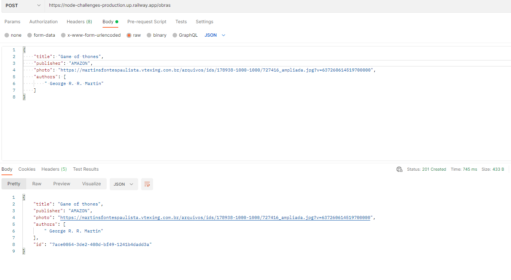
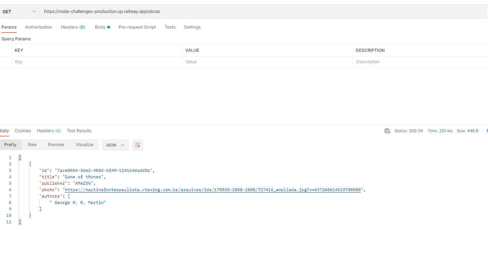
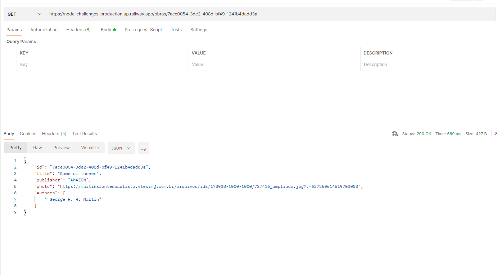
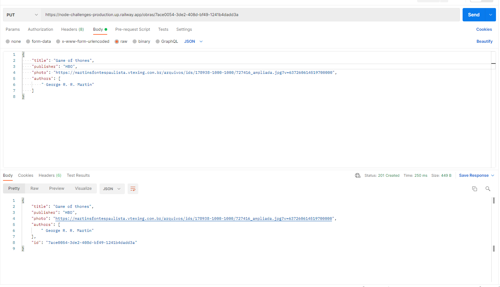
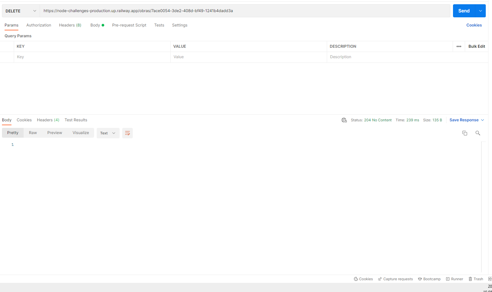

# Desafio

Criar o backend para um sistema de gerenciamento de uma biblioteca!

## Requisitos:

### Rotas da aplicação:

<b>[POST] </b> /obras : A rota deverá receber titulo, editora, foto, e autores dentro do corpo da requisição. Ao cadastrar um novo projeto, ele deverá ser armazenado dentro de um objeto no seguinte formato: { id: 1, titulo: 'Harry Potter', editora: 'Rocco',foto: 'https://i.imgur.com/UH3IPXw.jpg', autores: ["JK Rowling", "..."]};  
<b>[GET] </b> /obras/ : A rota deverá listar todas as obras cadastradas  
<b>[PUT] </b> /obras/:id: : A rota deverá atualizar as informações de titulo, editora, foto e autores da obra com o id presente nos parâmetros da rota  
<b>[DELETE] </b> /obras/:id: : A rota deverá deletar a obra com o id presente nos parâmetros da rota 

## Techs:

- Fastify
- Sqlite
- Eslint/Prettier

## Como/Por que foi feito

### Texto longo O desafio foi realizado para melhorar algumas habilidades, melhorar o portifólio e estudar alguns conceitos.

Foi utilizado o framework fastify, pois eu queria ter uma idéia de como funciona esse framework, pois é o framework node back-end que eu menos tenho conhecimento ( restify também ).
Basicamente a organização do projeto foi feito tentando aplicar a arquitetura hexagonal, que separa as camadas de uma forma onde não há um forte acoplamento entre as camadas do sistema. ( clean arch foi inspirada nesses conceitos ).  
Para ilustrar os benefícios dessa arquitetura ou de arquiteturas e estruturas que utilizam fraco acoplamento como norte, eu utilizei injeção de depêndencia e também inversão de depêndencia de forma manual ( dá para aplicar com libs, ou alguns frameworks ( nest ) já realizam automaticamente.
Também utilizei o padrão de software factory para criar diferentes formas/estratégias de armazenar os dados, mas de forma que extendam ou implementem uma interface comum.

## Texto resumido

- Foi utilizado ou o objetivo era utilizar a arquitetura hexagonal ou uma versão dela.
- Fastify
- Pattern Factory
- Injeção de depêndencia e também Inversão de depêndencia. ( de forma manual )

## Como executar

- npm install
- npm run start:dev

## Link

Foi feito o deploy da aplicação para a plataforma railway. https://node-challenges-production.up.railway.app/obras

## Prints

### POST /obras ( Criar )

### GET /obras (Buscar todos )

### get /obras/:id (Buscar Unico )

### PUT /obras/:id ( Atualizar )

### DELETE /obras/:id ( Deletar )

# Comunidade DevChallenge

Site: https://www.devchallenge.com.br/  
Discord: https://discord.gg/yvYXhGj  
Linkedin: https://www.linkedin.com/company/devchallenge/ 
Twitter: https://twitter.com/dev_challenge 
Instagram: https://www.instagram.com/devchallenge/ 
